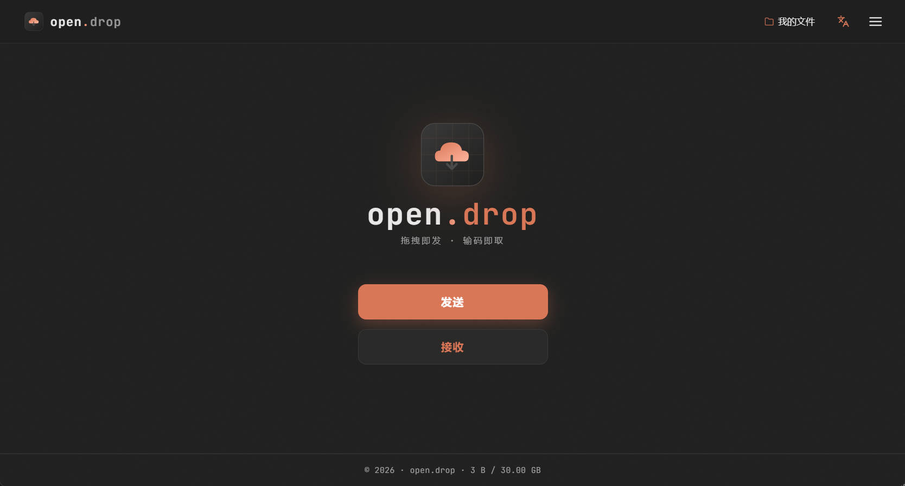

# open.drop

**[English version below ↓](#english)**

[](demo_pic.jpg)

一个**模仿 [AirPortal 空投快传](https://airportal.cn) 的开源临时文件传输站**。自托管，无数据库（JSON 索引 + 文件直接落盘），可在一台 1 GB 内存的小 VPS 上跑起来。

---

## 特性

- 📤 **拖拽即发**：把文件拖进页面、按 `Ctrl+V` 粘贴、或者点「文本」直接发一段纯文字
- 🔢 **6 位取件码**：接收端只需输码即可取件，不需要账号
- 🔒 可选密码、下载次数（默认 2 次）、有效期（最长 7 天）
- 🌐 **链接 = 引导页**：复制出来的下载链接 `https://your.host/d/CODE` 是带「下载」按钮的页面，不是直链
- 👤 **可选账号**：用户名 / 密码任意填，账户 7 天有效、可随时一键续期；账号唯一用途是查看 / 删除自己上传过的包裹
- 🛡️ **管理后台 `/admin`**：默认账号 / 密码均为 `admin`（**首次登录后请立即修改**），可在线查看所有包裹和账号、删除、续期、调整限额
- 💾 **零数据库**：所有元数据写到 `data/db.json`，文件 blob 落到 `data/uploads/<code>/`
- 🌏 **中英文一键切换**：右上角文 A 图标

## 安装（一键脚本）

```bash
curl -fsSL https://raw.githubusercontent.com/MrTangLuyao/opendrop/main/lazyrun.sh -o lazyrun.sh
sudo bash lazyrun.sh
```

脚本会做这些事：

1. `apt-get install` 基础依赖（curl, git, nginx, certbot, build-essential …）
2. 安装 Node.js 20.x LTS + PM2
3. `git clone https://github.com/MrTangLuyao/opendrop` 到 `/opt/opendrop`
4. `npm install --omit=dev` + PM2 守护进程
5. 询问是否开启 BBR 网络加速
6. 询问是否配置域名反向代理 + 自动申请 SSL 证书（Nginx 已经把 `client_max_body_size` 调到 5 GB，避免大文件 413）
7. 安装 CLI 工具 `opendrop`

## 管理命令

部署完成后，全局命令 `opendrop` 即可管理服务：

```
opendrop start | stop | restart | status | logs
opendrop config      # 查看当前限额
opendrop update      # 拉取 GitHub 最新版本并重启
opendrop reset       # 清空所有上传文件和账户（保留管理员）
opendrop uninstall   # 彻底卸载
```

## 限额（可在 `/admin` 在线修改，亦可用环境变量初始化）

| 项目 | 默认 | 环境变量 |
|---|---|---|
| 单次上传 | 5 GB | `OPENDROP_MAX_UPLOAD_GB` |
| 系统总存储 | 30 GB | `OPENDROP_MAX_STORAGE_GB` |
| 最长有效期 | 168 h (7 天) | `OPENDROP_MAX_EXPIRY_HOURS` |
| 服务端口 | 3000 | `PORT` |

⚠️ 系统存储满后会**拒绝新上传**（返回 `507`），**不会自动删除旧文件** — 这与 sync-station 的滚动覆盖策略不同。

## 自行开发

```bash
git clone https://github.com/MrTangLuyao/opendrop
cd opendrop
npm install
node server.js          # http://localhost:3000
```

无任何原生依赖，跨平台。

## 协议

MIT

---

<a id="english"></a>

# open.drop (English)

**An open-source imitation of the [AirPortal](https://airportal.cn) file-drop service.** Self-hosted, no SQL database, files stored directly on disk. Runs on a 1 GB-RAM VPS.

[](demo_pic.jpg)

## Features

- 📤 **Drop to send** — drag files onto the page, `Ctrl+V` to send clipboard content, or click *Text* to send a plain-text snippet
- 🔢 **6-digit pickup codes** — receiver just enters the code, no account needed
- 🔒 Optional password, configurable download limit (default 2), expiry up to 7 days
- 🌐 **Link = landing page**, not a direct download — share URLs look like `https://your.host/d/CODE` and open a "Download" button page
- 👤 **Optional accounts** — any username / password works, accounts last 7 days and renew with one click; the only thing accounts unlock is *My files* (view / delete your own uploads)
- 🛡️ **Admin panel at `/admin`** — default credentials `admin` / `admin` (**change them immediately on first sign-in**). Inspect every parcel & account, delete, renew, tune limits live
- 💾 **No database** — index lives in `data/db.json`, blobs in `data/uploads/<code>/`
- 🌏 Bilingual UI (zh ⇄ en), toggled from the navbar

## One-line install

```bash
curl -fsSL https://raw.githubusercontent.com/MrTangLuyao/opendrop/main/lazyrun.sh -o lazyrun.sh
sudo bash lazyrun.sh
```

The script will:

1. `apt-get install` base packages (curl, git, nginx, certbot, build-essential …)
2. Install Node.js 20.x LTS + PM2
3. `git clone https://github.com/MrTangLuyao/opendrop` into `/opt/opendrop`
4. `npm install --omit=dev` and start under PM2
5. Optionally enable BBR for TCP throughput
6. Optionally configure an Nginx reverse proxy and request an SSL cert with certbot (`client_max_body_size` is set to 5 GB so large uploads don't hit a 413)
7. Install the `opendrop` CLI

## CLI

After install, the global `opendrop` command manages the service:

```
opendrop start | stop | restart | status | logs
opendrop config      # show current limits
opendrop update      # pull latest from GitHub and restart
opendrop reset       # wipe all parcels and user accounts (keeps the admin)
opendrop uninstall   # remove everything
```

## Limits (editable live via `/admin`, or seeded by env vars)

| Setting | Default | Env var |
|---|---|---|
| Per-upload | 5 GB | `OPENDROP_MAX_UPLOAD_GB` |
| System storage | 30 GB | `OPENDROP_MAX_STORAGE_GB` |
| Max expiry | 168 h (7 d) | `OPENDROP_MAX_EXPIRY_HOURS` |
| Port | 3000 | `PORT` |

⚠️ When the system store is full, **new uploads are rejected** (HTTP 507) — old files are **not** evicted. Different from sync-station's rolling-deletion strategy.

## Local development

```bash
git clone https://github.com/MrTangLuyao/opendrop
cd opendrop
npm install
node server.js          # http://localhost:3000
```

No native build deps — runs on any Node ≥ 18.

## License

MIT
